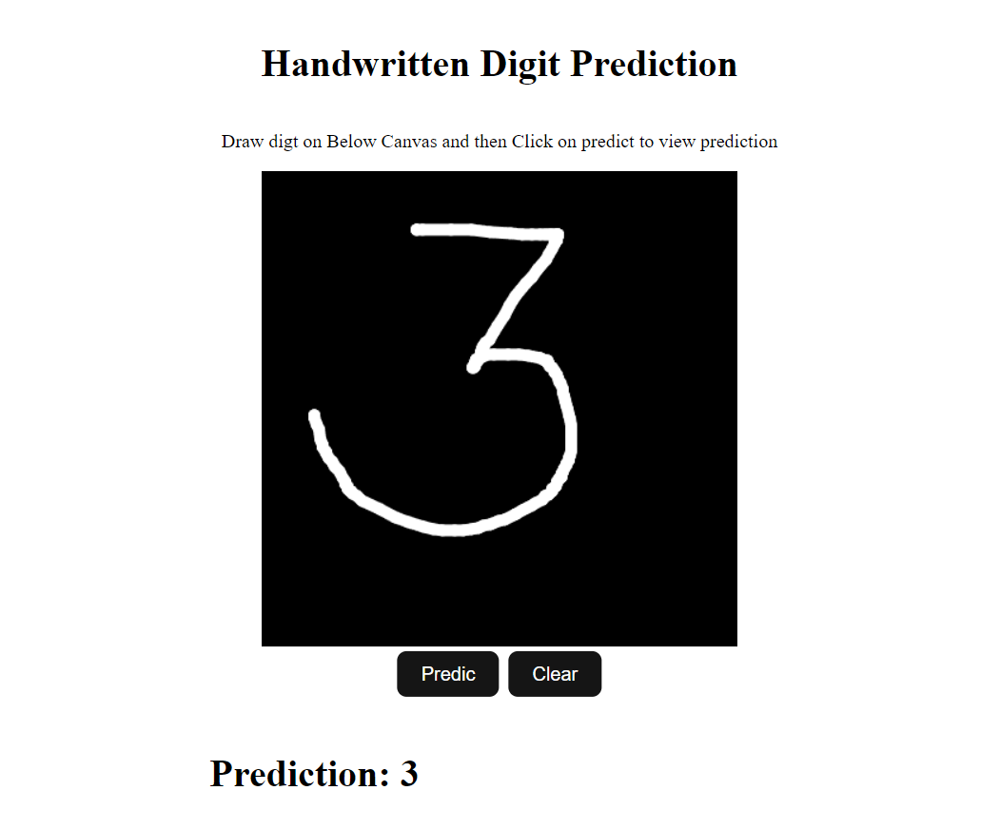

# Handwritten Digit Classification :

This is a small deep learning project I've developed. It involves training a Convolutional Neural Network (CNN) on the MNIST dataset to accurately recognize handwritten digits. Subsequently, I established a web application using Flask to provide a user-friendly interface. This application includes a graphical user interface (GUI) allowing users to draw digits directly on a canvas. The model then processes these drawn digits to predict the corresponding numerical value.

To ensure a structured and organized development process, I adopted a modular coding approach. This approach involves breaking down the project into distinct steps, including data ingestion, data preprocessing, and model training. Additionally, I leveraged DVC (Data Version Control) to effectively track the entire pipeline, enhancing collaboration and reproducibility.

By following this systematic approach, I aimed to create an efficient and robust system for handwritten digit recognition, seamlessly integrating machine learning with web technology.

### Project Screenshots




# Setup This Project Locally


###  1. Create conda env or venv python == 3.9

###  2. Clone this repository

###  3. Install requirements.txt

 ```
pip install -r requirements.txt
 ```
###  4. Run Training Pipeline
```
dvc repro
```
This command will automaticaly run training pipeline. It will run all the steps in training
1. Ingest data: This step will download data from source url and create train.csv and test.csv

2. Training model: This step will create the model and do training and then save model in artifacts/models/model/h5
       
3. Evaluate model: This step will load trained model from directory and will evaluate trainig model.

###  5. Run web app

```
python app.py
```
### visit http://127.0.0.1:3000/ in browser to access app

## To track experiments 
run command
```
mlflow ui
```

visit http://127.0.0.1:3000 in browser to see experiments.